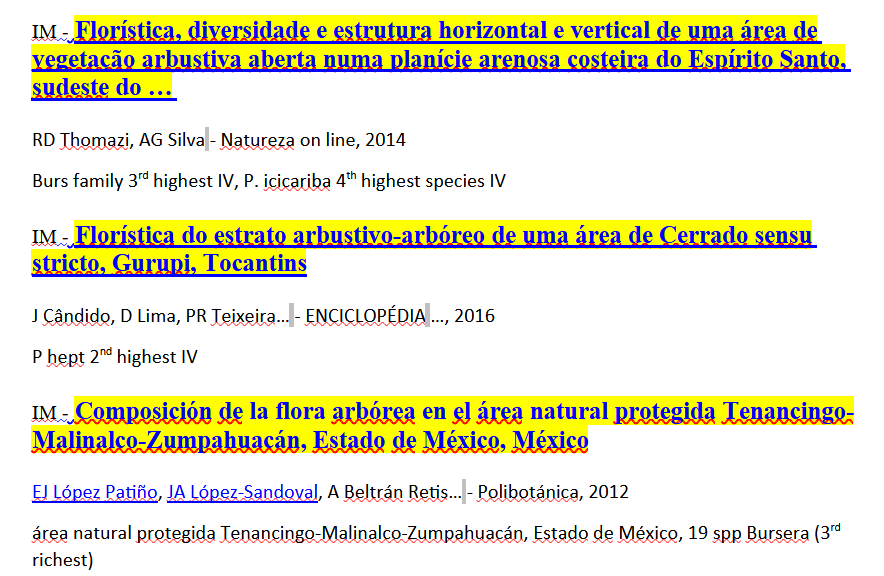

```{r setup, include=FALSE}
options(htmltools.dir.version = FALSE)
knitr::opts_chunk$set(echo = FALSE,
                      collapse = TRUE,
                      warning = FALSE,
                      message = FALSE,
                      fig.retina = 3,
                      out.width = "100%")
suppressPackageStartupMessages(library("knitr"))
# xaringan::summon_remark()# para trabalhar offline!
```

```{r xaringan-themer, include=FALSE}
library("xaringanthemer")
style_mono_light(
  base_color = "#23395b",
  inverse_link_color = "#E9EBEE",
  # text_bold_color = "#035AA6",
  text_bold_color = "#03A696",
  code_inline_background_color  = "#E9EBEE"
  )
```

```{r xaringanExtra, include=FALSE}
xaringanExtra::use_xaringan_extra(c("tile_view", "tachyons"))
```

```{r emoji, include=FALSE}
library("emoji")
desespero <- 
  emojis %>% filter(name == "person facepalming") %>% 
  .[["emoji"]]
fantasma <- 
  emojis %>% 
  # filter(grepl("ghost", name))
  filter(name == "ghost") %>%
  .[["emoji"]]
```


class: left, middle
background-image: url("images/slide_abertura.png")
background-size: cover


.pull-left[

# `r rmarkdown::metadata$title`

### `r rmarkdown::metadata$author`

### `r rmarkdown::metadata$date`

]

---

name: sou-eu

class:inverse

background-image: url("images/Bignoniaceae_Ecuador_FCAT_ROPerdiz.jpeg")
background-repeat: no-repeat
background-position: 10% 40%
background-size: 20%

.pull-right[

<br><br>
<br>
<br>
### `r rmarkdown::metadata$author`
  
### `r rmarkdown::metadata$role` (`r rmarkdown::metadata$org`)
    
### [`r icons::fontawesome("paper-plane")` ricoperdiz@gmail.com](mailto:ricoperdiz@gmail.com)
    
### [`r icons::fontawesome("link")` ricardoperdiz.com](https://ricardoperdiz.com)
    
### [`r icons::fontawesome("github")` @ricoperdiz](https://github.com/ricoperdiz)
    
]

---

name: o-que-e-rmarkdown

class: center, middle, inverse

## _R Markdown_ fornece uma **estrutura** de autoria unificada para ciência de dados, **combinando** seu _código_, seus _resultados_ e seus _comentários_ em **prosa**<sup>1</sup>

.footnote[(1) https://r4ds.had.co.nz/r-markdown.html]

---

class: middle, center

# Comunicação

--

# Colaboração

--

# Ambiente para se fazer ciência

---

class: middle, center, inverse

## E daí?

--

# POR QUÊ?

???

https://intro2r.com/why-use-r-markdown.html

---

class: inverse, center, middle

### Transparência

--

### Disponibilidade dos dados

--

### Reutilização de dados

--

# Reprodutibilidade

---

class: inverse, center, middle

# Funcionalidades

---

class: middle

# Livro

```{r}
knitr::include_url("https://intror.netlify.app/")
# knitr::include_graphics("images/intror.png")
```

.footnote[https://intror.netlify.app/]

---

class: middle

# Apresentações

```{r}
knitr::include_url("https://minicurso-elaboracao-mapa-r-dia01.netlify.app/")
# knitr::include_graphics("images/pres.png")
```

.footnote[https://minicurso-elaboracao-mapa-r-dia01.netlify.app/]

---

class: middle

# Artigos científicos

```{r}
knitr::include_url("https://pkgs.rstudio.com/rticles/articles/examples.html")
# knitr::include_graphics("images/rticles.png")
```

.footnote[https://pkgs.rstudio.com/rticles/articles/examples.html]

---

class: middle

# Sítios web

```{r}
knitr::include_url("https://www.ricardoperdiz.com/")
# knitr::include_graphics("images/eu.png")
```

.footnote[https://www.ricardoperdiz.com/]

---

class: middle

# Tomada de decisão

```{r}
knitr::include_url("https://www.revistasg.uff.br/sg/article/view/1706/1713")
# knitr::include_graphics("images/dashboard.png")
```

.footnote[https://www.revistasg.uff.br/sg/article/view/1706/1713]

---

class: middle

# Tomada de decisão

```{r}
knitr::include_app("https://abenedetti.shinyapps.io/bioNPS/")
# knitr::include_graphics("images/shinyapp_bio.png")
```

---

class: middle

# Formatar referências == Pesadelo `r fantasma``r desespero``r desespero``r desespero``r fantasma`


```{r, eval=FALSE, include=FALSE}
knitr::include_url("https://www.unicamp.br/unicamp/ju/artigos/peter-schulz/referencias-nao-lidas-copiadas-ou-inexistentes-pelo-rigor-na-ciencia")

.footnote[https://www.unicamp.br/unicamp/ju/artigos/peter-schulz/referencias-nao-lidas-copiadas-ou-inexistentes-pelo-rigor-na-ciencia]
```

.pull-left[
.center[

```{r}

```

]
]

.pull-right[
.center[
```{r}

```

]
]

---

class: middle, inverse, center

# Em *Rmarkdown*,
# a SOLUÇÃO
# é

---

## Buscar a referência

```{r, attr.output='style="max-height: 100px;"'}
citation("MASS")
```


---

<!-- class: middle -->

## Compilar um arquivo `.bib`

```{r}
citation("MASS") |> toBibtex()
```

---

class: middle, center, inverse


```{r, include = FALSE}
citet(citation("MASS"))
```

## Escrever em Rmarkdown

```
----
author: "R. Perdiz"
bibliography: bib.bib
----

## Material e métodos

Utilizamos a função `lda()` do pacote MASS [@MASS] para efetuar uma análise discriminante.

## Referências


```

---

class: middle, center

## Material e métodos


Utilizamos a função `lda()` do pacote MASS (Venables & Ripley, 2002) para efetuar uma análise discriminante.

## Referências

```{r, comment="", results='asis'}
bibliography(style = "text")
```

---

background-image: url(https://r3-rmedicine.netlify.app/slides/images/quarto-how.png)
background-size: contain
background-position: bottom
class: center, top
background-color: #fff

# Como funciona ???

.left[
.footnote[Imagem: [https://r3-rmedicine.netlify.app/slides/images/quarto-how.png](https://r3-rmedicine.netlify.app/slides/images/quarto-how.png)]
]


---

class: inverse, center, middle

# Demonstração

---

class: middle

# Onde podemos aprender mais?

--

### [https://rmarkdown.rstudio.com/](https://rmarkdown.rstudio.com/)

--

### [https://quarto.org/](https://quarto.org/)

--

### [Livro da *Curso-R* - https://livro.curso-r.com/9-2-r-markdown.html](https://livro.curso-r.com/9-2-r-markdown.html)

--

### Ou então ...

---

class: inverse, middle

.pull-left[
## Disciplina 

## **Tópicos especiais - Rmarkdown**

# comigo!
]

.pull-right[


]

---

name: gracias
class: middle

background-image: url("images/logos_abertura.png")
background-repeat: no-repeat
background-position: 80% 05%
background-size: 30%

.pull-left[


]

.pull-right[

# Grato pela atenção!

## Perguntas ?

### [`r icons::fontawesome("paper-plane")` ricoperdiz@gmail.com](mailto:ricoperdiz@gmail.com)
    
### [`r icons::fontawesome("link")` ricardoperdiz.com](https://ricardoperdiz.com)
    
### [`r icons::fontawesome("github")` @ricoperdiz](https://github.com/ricoperdiz)

]


